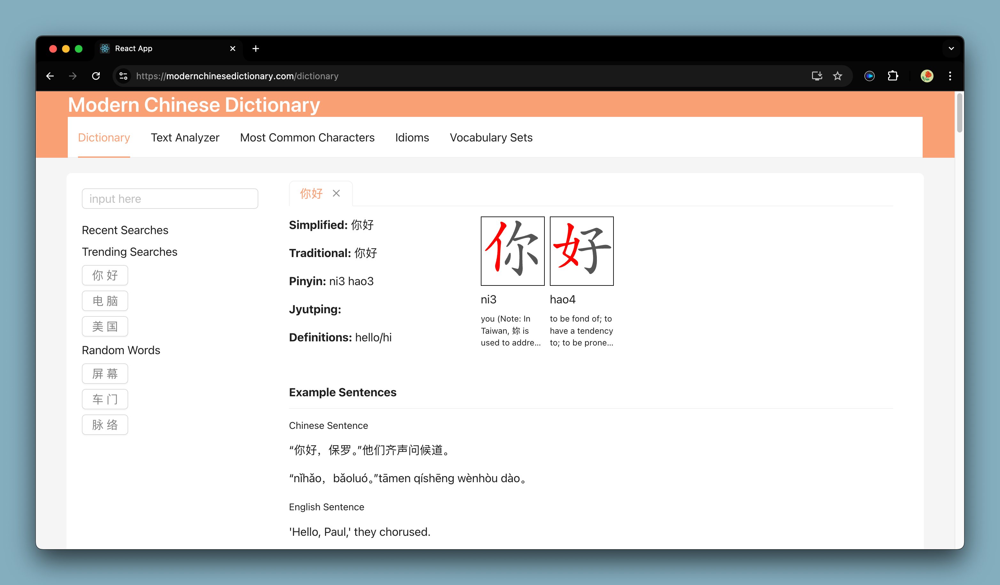

# Modern Chinese Dictionary
### [Access Modern Chinese Dictionary](https://modernchinesedictionary.com)
## A Chinese Language Learning Web Application

## Features
1. **Chinese to English Search**
2. **Block** of Text **Decomposition / Breakdown** 
3. **Most Common Characters** by most frequently seen. 
4. **Most Common Idioms** by most frequently used.

